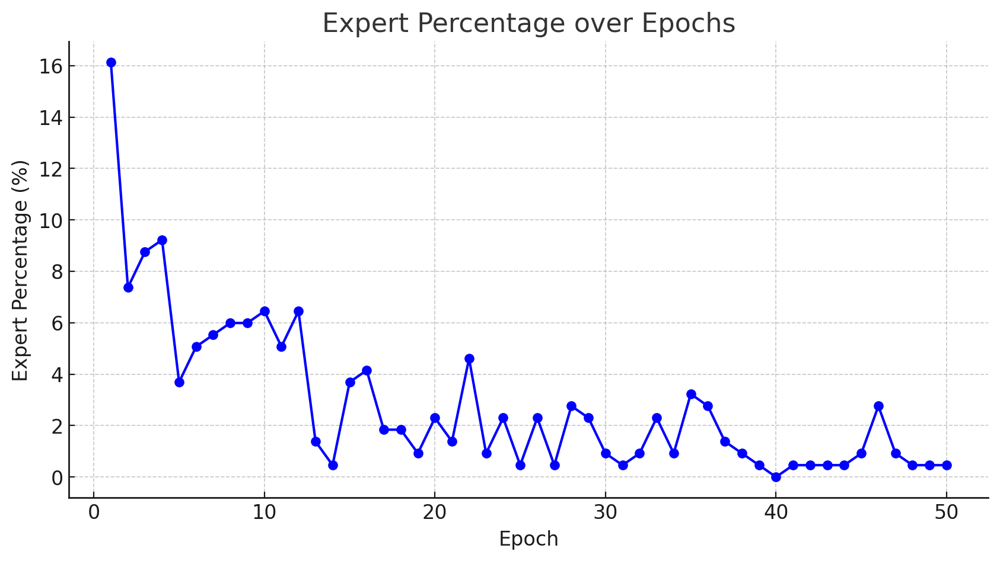

# robot_learning_hw_3

## 1. Collaboration Statement

- Eason Ding 
    - We are taking CPSC 552 Deep Learning together, and Eason propose to use the idea of `Teacher Forcing` in one of the DL homework as a start. After disscusion, we thought "active version" of `Teacher Forcing` might be applicable to this homework. Eason was also working on the criterian that we should "apply" `Teacher Forcing`.

- Ziyao Shangguan 
    - In the field of NLP, `Teacher Forcing` is more like a hard assignment rather than a soft assignment. In this homework, Ziyao slightly modify `Teacher Forcing` to make it as a soft assignment, that is, change it into a convex combination of the generated trajectory and the ground truth trajectory. 

- Chuhan Li
    - Chuhan was testing the idea of `Teacher Forcing` by choosing criterion, network architecture, and threshold tuning. More specifically, Chuhan tested MAE and MSE loss, normalizing factor, and soft assginment coefficient. 

All of us were using the same network architectures in hw2. Additionally, we tested different network structures such as spatial attention and MLP with more layers. However, neither of them performs better than a simple 4-layer MLP, hence we choose to keep everything simple and use MLP as a policy generator. 

## 2. Comparison with Passive Learning 

### 2.1 
We've tested active learning in our setting. Take `Coffee_d0` as an example, we found that in our setting, `Coffee_d0` performs a little bit worse than the passive learning. Even though both AL `Coffee_d0` and PL `Coffee_d0` can finish the task, PL's version, from our perspective, performs much smoother and more robust than the AL's version. Our original hypothesis is AL should perform slightly better than PL, however, our experiments show that this might not be the case. 

### 2.2 
We cannot achieve a better result than the non-AL implementation. Here's our explanations:

- For low-variance data (d_0), in our implementation, we prompt the user (expert demonstration) to provide the demonstration at each time of training. We then compare the distance between the generator's and the expert's trajectory. Similar to `Teacher Forcing`, we only input the generator's trajectory into training loop if and only if the generated trajectory is pretty much similar to the expert's trajectory, otherwise we will input the expert trajectory to the model to make sure the model is actually learning something. Below, we provide the percentage involving expert demonstration. Ideally, the percentage containing expert trajectories should get lower and lower indicating the quality of generated trajectory is getting better and better. 



### 2.3 
As we elaborated in the earlier session, our implement doesn't improve the performance. The below is our explanations:

- We are using a variation of `Teacher Forcing` in active learning task. In our setting, we use the expert's demonstration if and only if the generator's trajectory is very different from the expert's trajectory. The question becomes how can we effectively intergrate the information from both generator and expert, which we will elaborate below:

    - We are using a convex combination of the generated actions and expert's actions, i.e., 
    ```python
    augmented_action = [TEACHER_FORCING_RATIO * fake_actions[j][k] + (1-TEACHER_FORCING_RATIO) * e_actions[j][k] for k in range(7)]
    ```
    - We've tested different combination of `TEACHER_FORCING_RATIO` in our implementation, i.e., `TEACHER_FORCING_RATIO = 0.0`, `TEACHER_FORCING_RATIO = 0.2`, `TEACHER_FORCING_RATIO = 0.8`, and `TEACHER_FORCING_RATIO = 1.0`. We found that when `TEACHER_FORCING_RATIO = 0.0`, model performs the best, which means when the generated trajectory is very different from the expert trajectory, we will use the expert's demonstration. This also makes sense in the real-world scenario, that is, human expert to "correct" the robot if the predicted trajectory is way too different from the "desired" trajectory. 
    - The other suboptimal parameter might be the threshold value, i.e., 
    ```python 
    er = torch.abs(mse_loss(fake_actions[j], e_actions[j]) / torch.mean(fake_actions[j])).detach().cpu().numpy()
    ```
    - The threshold is calculated by the MSE loss between the generated actions and the expert actions. We are comparing the error rate with a **pre-defined** threshold value, we've tested the threshold value ranging from 0.001, 0.01, 0.1, 1, 10, and 100. We will show the plot below in the Coffee task. 
    

## 3. Number of interactions 
### 3.1 Number of interactions vs. performance
As we elaborate before, we are using threshold to control the number of interactions. In the plot below, the x-axis is the threshold and the y-axis is the loss. The higher the threshold, the more interaction will be used in training. 


### 3.2 


## 4. Reflection

We are surprised by the result that AL didn't perform well as non-AL versions. For the future improvements, we are considering the below directions:

- In loss combination, we are only incorporating the `BCE_loss` and `MSE_loss`, in the future, we might want to include a loss measuring the distributional similarity/difference between the generated and the expert demonstration, such as KL-divergence.

- As we tested before, the use of end-effector-camera image doesn't improve the performance a lot. We might want to add this features in the feature by applying a better-design network. 

- For policy generator, we've tried to make the network deeper (including have more Conv layers and more MLP layers). However, the performance didn't improve a lot, we hypothesize that as the network gets deeper, we need more epoches. In the future, we might want to design a network structure that can capture the essence of the action space. 

- For discriminator, we've tried to use spatial attention in hw2, but the performance drops even though we make the attention deeper. We might want to incorporate some vision-related information into the spatial attention in the future. 